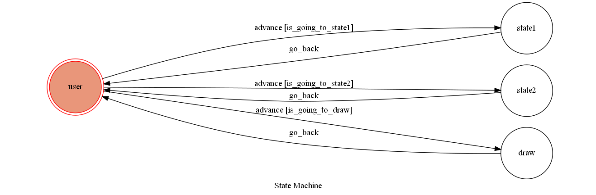

# TOC Project F74089012

## Finite State Machine

## Usage
The initial state is set to `user`.

Every time `user` state is triggered to `advance` to another state, it will `go_back` to `user` state after the bot replies corresponding message.

* user
	* Input: "go to state1"
		* Reply: "Trigger state1"

	* Input: "go to state2"
		* Reply: "Trigger state2"

	* Input: "draw"
		* Reply: "Fsm image"

